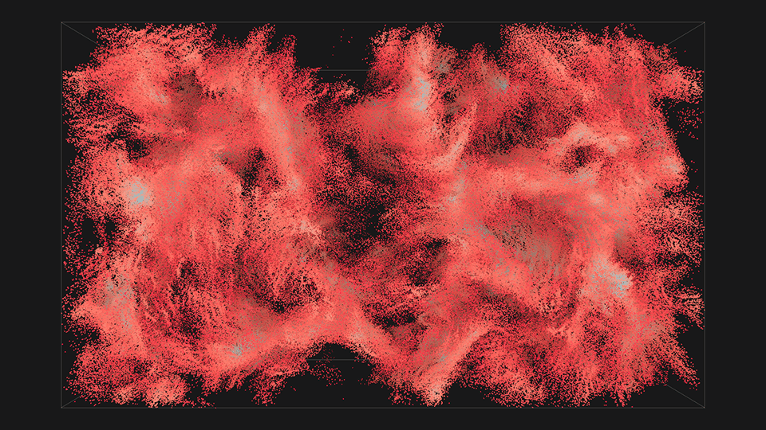
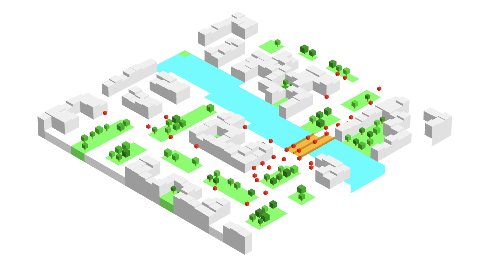

 

@vojtatom here ✨ WebGL, Typescript, Geospatial data

Links:

- [flocking.cpp - repo and article exploring the flocking algorithm](https://vojtatom.github.io/flocking.cpp/)
- [metacity tools - urban data visualization](https://metacity.cc)
- [ni-ccc course at FIT CTU in Prague](https://ni-ccc.github.io)

How to reach me:

- [discord](http://discordapp.com/users/677925589599911936)
- [mail](mailto:hello@vojtatom.cz)

---

FIT CTU students who want access to NI-CCC course repo, please message me on discord, I'll be happy to assist you thank you 
