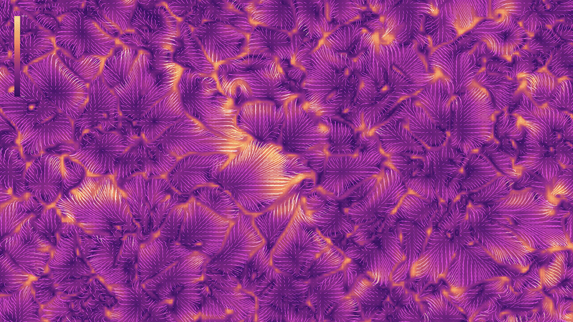

 

@vojtatom here

Some links:

- [flocking.cpp - repo and article exploring the flocking algorithm](https://vojtatom.github.io/flocking.cpp/)
- [numflow.py - repo and article exploring vector data visualization](https://vojtatom.github.io/numflow.py/)
- [metacity - urban data visualization](https://metacity.cc)

How to reach me:

- [discord](http://discordapp.com/users/677925589599911936)
- [mail](mailto:hello@vojtatom.cz)

---
  

FIT CTU students who want access to <a href="https://ni-ccc.github.io">ni-ccc course repo at FIT CTU in Prague</a>, please message me on discord, I'll be happy to assist you, thank you 
